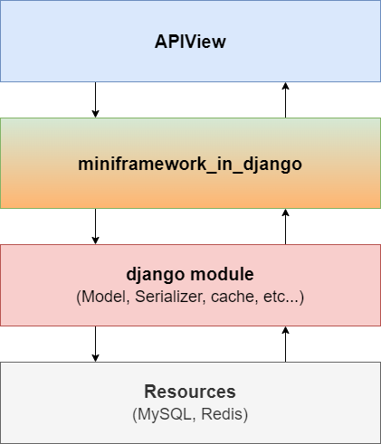
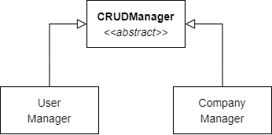
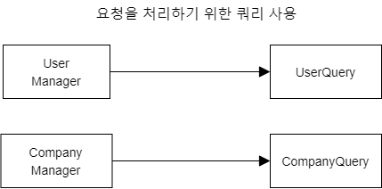
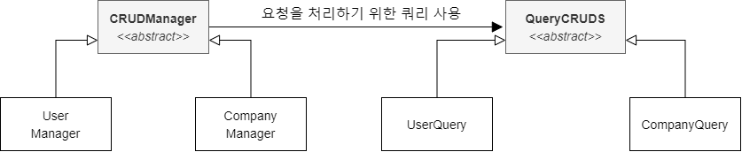
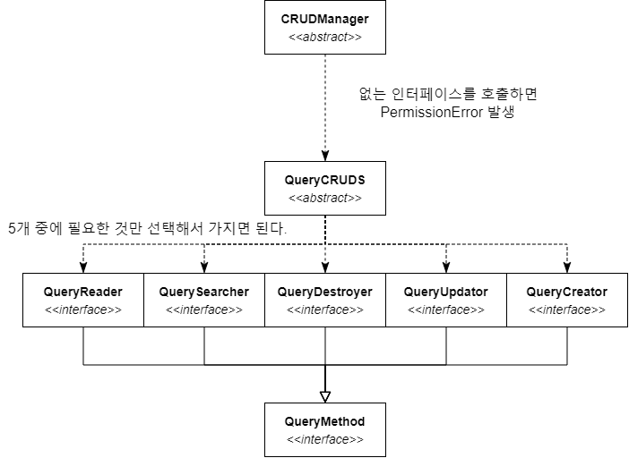
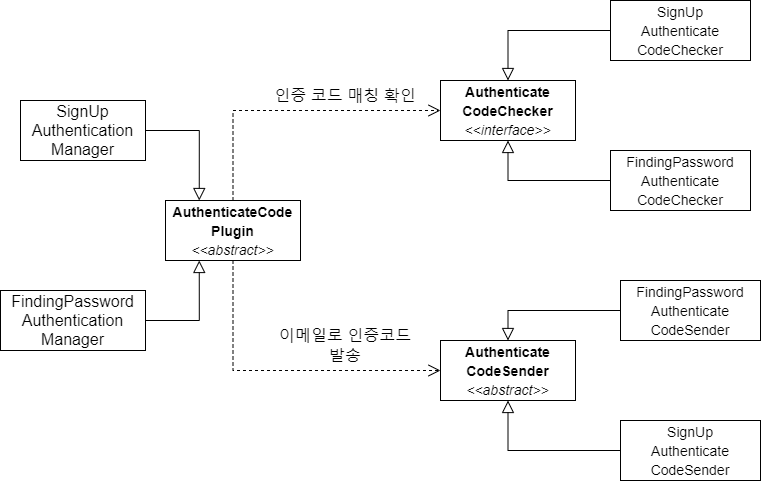

# 윈티드 프리온보딩 2차 5주차 개인과제

<div style="display: flex; align-items: flex-start; justify-content: center;">
    
    
    
    
    
</div>

> ⚠️ 현재 프로젝트는  DJango와 자체 설계된 Architecture 위에 구현이 진행되고 있습니다. 아직 구현 초기에 Architecture 마저 
> 리펙토링을 수행하지 않았으므로 코드 컨벤션이 심각하게 난잡한 상태 입니다.

## 개요

회사 데이터를 생성하고 언어에 따른 회사 검색을 수행합니다.

## 상태
**마감 (100%)**
  * **사용자 CUD (100%)**
    * 사용자 회원가입 (100%)
    * 사용자 수정/패스워드 찾기/탈퇴 (100%)
  * **회사 데이터 CRUD+S (100%)**
    * Model 설계 (100%)
    * CRUD구현 (100%)
    * 검색 기능 구현(100%)
  * **리팩토링 (100%)**
    * 1차 리팩토링 (클래스 및 함수 일부 재셜계) (100%)
  * **Document 정리 (100%)**
    * Notion 정리 (100%)
    * Readme 정리 (100%)

아래 노션 버튼을 클릭하면 프로젝트에 대한 자세한 내용을 볼 수 있습니다. (작성중)

[](https://plum-bearberry-96a.notion.site/2-5-Wanted-b2e5b68dbf354f6cb604ce6d966c5e4b)

## 요구 사항
### 기존 요구 사항
#### 필수
* 회사명 자동완성
  * 회사명의 일부만 들어가도 검색이 되어야 합니다.
* 회사 이름으로 회사 검색
* 새로운 회사 추가
* 이때 검색 결과는 언어에 따라 달라야 합니다.
#### 선택
* Dockerising 및 배포
### 자체 설정된 요구 사항
* 사용자 및 회사 정보 CRUD
* 계정 시스템 추가
  * 회사 데이터를 관리하려면 로그인을 해야 합니다.
  * 로그인 여부는 jwt로 구분합니다.
  * 회원 가입을 할 때, 이메일과 6자리 인증 코드로 인증을 한 다음 계정을 생성합니다.
  * 계정 타입은 다음과 같습니다.
    * Client: 회사 정보 검색만 가능합니다.
    * CompanyClient: 회사를 추가/수정 또는 제거할 수 있습니다. 단 이는 자신이 만든 회사 데이터에 한합니다.
    * Admin: 모든 권한을 가지고 있습니다.
* 회사 검색 기능 추가 _(Optional)_
  * 복수개의 Tag 단위로 검색해야 합니다.

## Directory Structure
```tree
├─access
│  ├─tests
│  └─utils
├─company
│  ├─tests
│  └─utils
├─user
│  ├─tests
│  └─utils
|-search
|-config
├─core
│  └─miniframework_on_django        
└─config
```
* access: 사용자 인증과 관련된 app 입니다.
  * 기능
    * 회원 가입
    * 로그인
* company: 회사 CRUD 관련 기능을 가지는 app 입니다.
  * 기능
    * 기본 CRUD
    * 회사 검색 (연관 검색, 태그 등..)
* user: 사용자 관련 app 입니다.
  * 기능
    * 사용자 프로필 수정
    * 탈퇴
    * 사용자 프로필 검색
* search: 검색 관련 앱으로 uri가 search로 시작합니다. 기능은 다른 app에 있고 url만 만들어져 있습니다.
* config
  * 서버를 작동시키기 위한 설정 데이터가 들어 있습니다.
* core/miniframework_on_django
  * DJango위에 설계된 자체 Architecture 입니다. 범용성을 목표로 하고 있기 때문에 해당 프로젝트에만 국한되는 것이 아닌 다른 프로젝트에서도 적용이 되게 설게/구현하고 있습니다.

## 실행 방법
1. MySQL과 Redis를 구동합니다.
2. Python 가상 머신을 생성합니다.
3. git repository를 다운받습니다.
4. 해당 명령어로 패키지를 설치합니다.
    ```bash
   $ pip install -r requirements.txt
   ```
5. 프로젝트 최상위 위치에 .env파일을 생성해서 아래와 같이 입력 합니다.
    ```.env
   DJANGO_SECRET_KEY=<Django secret key>
   EMAIL_SENDER_HOST=<admin email 주소 (gmail 기준)>
    EMAIL_SENDER_PASSWD=<email 2차 비빌번호 (gmail 기준)>
    MYSQL_HOST=<데이터베이스 호스트>
    MYSQL_USER=<데이터베이스 User>
    MYSQL_PASSWD=<데이터베이스 User 비밀번호>
    MYSQL_DATABASE<데이터베이스 이름>
    MYSQL_PORT=<데이터베이스 Port>
   REDIS_HOST=<Redis 호스트 -> "redis://<host>:<port>"

    JWT_KEY=<JWT 암호/복호화를 위한 Key 아무 문자열이나 입력>
    JWT_ALGORITHM=<JWT 알고리즘 (HS256 권장)>
   ```
6. 아래와 같이 명령어를 입력하여 실행합니다.
    ```bash
   python mange.py runserver --settings=config.settings.local
   ```

## 사용된 기술

### brcypt
패스워드를 저장할 때 해당 라이브러리르 사용해 패스워드를 암호화 해서 저장합니다.

### JWT
JWT로 인증 체제를 운용합니다.

### Redis

In-Memory Database, 즉 캐시 시스템 입니다. 해당 시스템의 사용 용도는 처음 사용자가 회원 가입 또는 패스워드를 찾을 때 이메일 인증 코드를 요청하는데,
이에 대한 정보를 RDB가 아닌 캐시에 저장합니다. 해당 데이터를 저장할 때 TTL을 설정하여 일정 시간이 지나면 캐시에서 자동으로 코드가 사라지게 되므로
자동으로 만료가 됩니다.


## Code Sitemap
* Views
  * [Access(인증)](access/views.py)
  * [User](user/views.py)
  * [Company](company/views.py)
* Models
  * [User](user/models.py)
  * [Company](company/models.py)
* Queries
  * [User](user/utils/queries.py)
  * [Company](company/utils/queries.py)

## DB Models


## miniframework_on_django

추가 확장 구현을 대비한 자체 제작된 DJango 기반 아키텍처. ```core``` 디렉토리에 해당 아키텍처가 구현되어 있습니다.



### 개요
* 기존 요구사항에 사용자 인증 시스템이 추가됨에 따라 어플리케이션 규모가 커짐
* 설계 없이 구현이 가능할 수 있으나, 차후 어플리케이션이 방대해짐에 따라 이에대한 대처 속도가 느려짐
* 따라서 새로운 기능이 추가될 때, 설계된 아키텍쳐를 따라 구현을 하면 개발 속도가 빨라질 것으로 기대
### 장점
* **쉬운 확장성**
  * 클래스 끼리 통신 또는 데이터를 주고 받을 때, 추상 클래스 끼리만 통신할 수 있게 설계를 해 놓으면 추상 클래스가 필요한 기능 구현을 할 경우, 해당 클래스만 상속하되 로직을 직접 구현하는 대신 클래스가 요구하는 변수만 지정하면 됩니다.
  * 이는 **개방 폐쇄 원칙** 과 **의존 역전 원칙** 에 포함되며 DRF의 Model, Serializer가 이 경우에 해당이 됩니다.
* **쉬운 디버깅**
  * **단일 책임의 원칙 (SRP)** 으로 설계 되어 있기 때문에, 어느 기능 중 일부분에 오류가 생기면 해당 기능을 작동시키는 객체만 찾아서 디버깅을 하면 됩니다.
### 단점
* **우리끼리만 볼 수 있다.**
  * 장고 모듈이 아키텍처 안에 숨어 있기 때문에 해당 아키텍처를 이해하지 않는 이상, 처음 코드를 본 사람의 경우 이해하기가 난해합니다. 당장 여기에서도 마찬가지로 순수 장고 문법은 표면에 보이지 않고, 아키텍쳐의 깊은 곳에 작성되어져 있습니다.
* **너무 많은 비용의 아키텍처 설계/구현**
  * 말 그대로 맨 밑바닥에서 설계가 들어가기 때문에 차후에 앱이 방대해짐을 예상하면서 신중하게 설계해야 합니다.
* **아키텍쳐 부분에 결함이 생기면 뜯어고쳐야 할 것이 많다.**
  * 모든 기능 객체들이 아키텍처에 의존하고 있다 즉, 뼈대 자체가 문제가 생겼기 때문에 상당 부분의 로직을 수정해야 하며 심할 경우, 코드를 갈아엎어야 할 수 있습니다.

### Class Diagram


### 설계/구현 전략
#### 객체 지향 5대 원칙 (SOLID)
1. **단일 책임의 원칙 (Single Responsibility Principle)**
    * 하나의 모듈은 하나의 책임을 가져야 합니다.
    * 각 Layer의 모든 객체들은 하나의 책임만을 가지고 있습니다.
    * 아래의 예시의 경우 UserManager는 User관련된 일만 하고 CompanyManger는 Company 데이터를 관리하는 역할만 맡습니다.

        
2. **개방 폐쇄 원칙 (Open-Closed Principle)**
    * 확장에는 열려 있어야 하고 수정에는 닫혀 있어야 합니다.
    * 확장의 경우 새로운 기능을 추가할 때, 미리 정의된 인터페이스/추상클래스의 하애 쉽게 확장을 할 수 있고, 변경/수정의 경우 변경을 위한 비용을 최소화 해야 합니다.
    * DJango의 Model과 Serializer를 예시로 들 수 있습니다.
    * 아래의 예시의 경우, Before에서는 User단과 Company단의 클래스간 통신의 변경이 필요할 경우, 모든 클래스를 수정해야 하지만, After에서는 두 개의 추상 클래스의 로직만 수정하면 됩니다.
    * Before
        
        
    * After
    
        

3. **리스코프 치환 법칙 (Liskov Subsitution Principle)**
    * 자식 클래스는 필요시 부모 클래스로 교체 할 수 있어야 합니다. 즉 자식 클래스가 부모 클래스로 교체될 때, 부모 클래스에서 사용할 수 없는 메소드를 사용하면 안됩니다.
    * 해당 아키텍처는 자식 클래스가 부모 메소드를 오버라이딩하는 경우는 부모 메소드가 **추상 메소드**일 경우만 오버라이딩합니다.
4. **인터페이스 분리 원칙 (Interface Segregation Principle)**
    * 해당 객체가 굳이 사용하지 않는 메소드 까지 의존하면 안됩니다.
    * DJango의 mixin View가 이에 해당이 됩니다.
    * 아래 예시의 QueryCRUDS는 CRUD, 검색 중 필요한 인터페이스만 부착할 수 있으며 이를 사용하는 CRUDManager는 QueryCRUDS에 없는 기능을 수행하면  Permission에러가 발생합니다.
    
       
```python
class QueryCRUDS(metaclass=ABCMeta):
    creator: Optional[QueryCreator] = None
    reader: Optional[QueryReader] = None
    updator: Optional[QueryUpdator] = None
    destroyer: Optional[QueryDestroyer] = None
    searcher: Optional[QuerySearcher] = None

    def _run_query(self, method: Optional[QueryMethod], *args, **kwargs):
        if not method:
            raise PermissionError('method not allowed')
        return method(*args, **kwargs)

    def create(self, *args, **kwargs):
        return self._run_query(self.creator, *args, **kwargs)

    def read(self, *args, **kwargs):
        return self._run_query(self.reader, *args, **kwargs)

    def update(self, *args, **kwargs):
        return self._run_query(self.updator, *args, **kwargs)

    def destroy(self, *args, **kwargs):
        return self._run_query(self.destroyer, *args, **kwargs)
    
    def search(self, *args, **kwargs):
        return self._run_query(self.searcher, *args, **kwargs)
```

5. **의존 역전 원칙 (Dependency Inversion Principle)**
   * 하위 레벨 모듈(부모 클래스)의 변경이 상위 레벨(자식 클래스)에 영항을 미치지 말아야 합니다. 즉 부모 클래스가 변경이 되었다고 해서 자식 클래스 까지 변경을 가하면 안됩니다.
   * 변경이 자식 클래스 까지 영향을 미치지 않게 하려면 부모 클래스가 자식 클래스에 의존해서는 안됩니다.
   * 부모 클래스 끼리 통신을 하고, 이때 부모 클래스의 메소드를 추상 메소드로 비워놓고 자식 클래스에서는 추상 메소드만 실체화 하는 방법이 있습니다.
   * 확장 구현에 있어서 큰 영향을 미치며 개인적으로 가장 중요한 원칙이라고 생각합니다.
   * 아래 예시는 인증 목적에 따른 설계 입니다.

        
    
```python
class AuthenticateCodeChecker(metaclass=ABCMeta):
    @abstractmethod
    def match(self, *args, **kwargs) -> bool:
        pass


class AuthenticateCodeSender(metaclass=ABCMeta):
    ttl: int

    def get_ttl_second(self):
        return self.ttl * 60

    @abstractmethod
    def generate_code(self, *args, **kwargs) -> str:
        pass

    @abstractmethod
    def save_code(self, audience, auth_code):
        pass

    @abstractmethod
    def send_code(self, audience, auth_code):
        pass

class AuthenticateCodePlugin(metaclass=ABCMeta):
    """
    AuthenticationManager에 추가적으로 붙는 핸들러로
    인증을 위한 임시 코드 발송/확인 절차 추가
    :variable sender <AuthenticateCodeSender>: 임시 코드를 전송할 때 사용한다.
    :variable checker <AuthenticateCodeChecker>: 임시 코드가 맞는 지 매칭할 때 사용된다.
    """
    sender: AuthenticateCodeSender
    checker: AuthenticateCodeChecker

    def request_code(self, audience, *args, **kwargs):
        """
        임시 코드 발송 요청
        :param audience: 발송 요청자, 이메일이 될 수도 있고 문자 발송을 위한 전화번호도 될 수 있다.
        :param args, kwargs: 추가적으로 붙는 옵션
        """
        auth_code = self.sender.generate_code(audience, *args, **kwargs)
        self.sender.save_code(audience, auth_code)
        self.sender.send_code(audience, auth_code)

    def match_code(self, *args, **kwargs):
        """
        코드가 일치한 지 매칭
        """
        return self.checker.match(*args, **kwargs)
```

#### 사용된 디자인 패턴
(리팩토링 진행 시 적용 예정)
#### 메모리/성능 관리
(리팩토링 진행 시 적용 예정)


