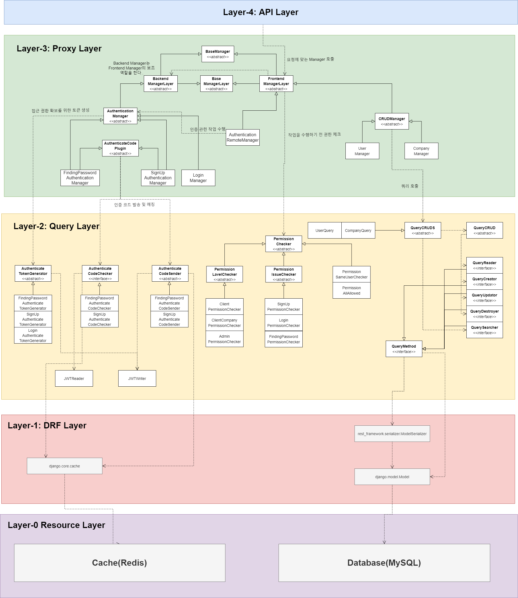

# 윈티드 프리온보딩 2차 5주차 개인과제

<div style="display: flex; align-items: flex-start; justify-content: center;">
    
    
    
    
    
</div>

> ⚠️ 현재 프로젝트는  DJango와 자체 설계된 Architecture 위에 구현이 진행되고 있습니다. 아직 구현 초기에 Architecture 마저 
> 리펙토링을 수행하지 않았으므로 코드 컨벤션이 심각하게 난잡한 상태 입니다.

**상태: 진행중 (70%)**
  * **사용자 CUD (100%)**
    * 사용자 회원가입 (100%)
    * 사용자 수정/패스워드 찾기/탈퇴 (100%)
  * **회사 데이터 CRUD+S (100%)**
    * Model 설계 (100%)
    * CRUD구현 (100%)
    * 검색 기능 구현(100%)
  * **리팩토링 (0%)**
    * 1차 리팩토링 (클래스 및 함수 일부 재셜계) (0%)
    * 2차 리팩토링 (테스트 코드/보안 강화) (0%)
    * [_Optional_] 추가 기능 확장 구현 (0%) 
    * [_Optional_] 최종 리팩토링 (추가 구현에 따른 1/2차 반복) (0%)
  * **Document 정리 (30%)**
    * Notion 정리 (30%)
    * Readme 정리 (50%)
    * 자체 아키텍처 관련 내용 추가 정리 (0%)
  * [_Optional_] Dockerizing (0%)

아래 노션 버튼을 클릭하면 프로젝트에 대한 자세한 내용을 볼 수 있습니다. (작성중)

[](https://plum-bearberry-96a.notion.site/2-5-Wanted-b2e5b68dbf354f6cb604ce6d966c5e4b)


## 개요

회사 데이터를 생성하고 언어에 따른 회사 검색을 수행합니다.

## 요구 사항
### 기존 요구 사항
#### 필수
* 회사명 자동완성
  * 회사명의 일부만 들어가도 검색이 되어야 합니다.
* 회사 이름으로 회사 검색
* 새로운 회사 추가
* 이때 검색 결과는 언어에 따라 달라야 합니다.
#### 선택
* Dockerising 및 배포
### 자체 설정된 요구 사항
* 계정 시스템 추가
  * 회사 데이터를 관리하려면 로그인을 해야 합니다.
  * 로그인 여부는 jwt로 구분합니다.
  * 회원 가입을 할 때, 이메일과 6자리 인증 코드로 인증을 한 다음 계정을 생성합니다.
  * 계정 타입은 다음과 같습니다.
    * Client: 회사 정보 검색만 가능합니다.
    * CompanyClient: 회사를 추가/수정 또는 제거할 수 있습니다. 단 이는 자신이 만든 회사 데이터에 한합니다.
    * Admin: 모든 권한을 가지고 있습니다.
* 회사 검색 기능 추가
  * 복수개의 Tag 단위로 검색해야 합니다.

## Directory Structure
```tree
├─access
│  ├─tests
│  └─utils
├─company
│  ├─tests
│  └─utils
├─user
│  ├─tests
│  └─utils
├─core
│  └─miniframework_on_django        
└─config
```
* access: 사용자 인증과 관련된 app 입니다.
  * 기능
    * 회원 가입
    * 로그인
* company: 회사 CRUD 관련 기능을 가지는 app 입니다.
  * 기능
    * 기본 CRUD
    * 회사 검색 (연관 검색, 태그 등..)
* user: 사용자 관련 app 입니다.
  * 기능
    * 사용자 프로필 수정
    * 탈퇴
    * 사용자 프로필 검색
* config: 
* core/miniframework_on_django
  * DJango위에 설계된 자체 Architecture 입니다. 범용성을 목표로 하고 있기 때문에 해당 프로젝트에만 국한되는 것이 아닌 다른 프로젝트에서도 적용이 되게 설게/구현하고 있습니다.


## 사용된 기술

### brcypt
패스워드를 저장할 때 해당 라이브러리르 사용해 패스워드를 암호화 해서 저장합니다.

### JWT
JWT로 인증 체제를 운용합니다.

### Redis

In-Memory Database, 즉 캐시 시스템 입니다. 해당 시스템의 사용 용도는 처음 사용자가 회원 가입 또는 패스워드를 찾을 때 이메일 인증 코드를 요청하는데,
이에 대한 정보를 RDB가 아닌 캐시에 저장합니다. 해당 데이터를 저장할 때 TTL을 설정하여 일정 시간이 지나면 캐시에서 자동으로 코드가 사라지게 되므로
자동으로 만료가 됩니다.


## 자체 Architecture 설계 (miniframework_on_django)
### 개요
* 기존 요구사항에 사용자 인증 시스템을 추가
### 굳이 이렇게 까지 하는 이유
1. 객체 지향 설계 실습
2. 개인 프로젝트의 초석이 될 과제
### UML
<details>
<summary>UML 보기</summary>
<div>



</div>
</details>

### 설계/구현 전략
#### 객체 지향 5대 원칙 (SOLID)
1. **단일 책임의 원칙 (Single Responsibility Principle)**
2. **개방 폐쇄 원칙 (Open-Closed Principle)**
3. **리스코프 치환 법칙 (Liskov Subsitution Principle)**
4. **인터페이스 분리 원칙 (Interface Segregation Principle)**
5. **의존 역전 원칙 (Dependency Inversion Principle)**
#### 사용된 디자인 패턴
(리팩토링 진행 시 적용 예정)
#### 메모리 관리
(리팩토링 진행 시 적용 예정)

## DB Models


